# brick-icons

Render LEGO/LDraw parts as (optionally) lit and shaded SVG icons.

<table align="center">
  <tr>
    <td align="center">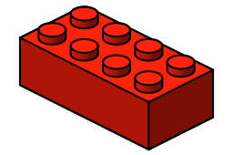</td>
    <td align="center">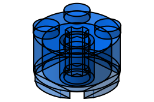</td>
    <td align="center">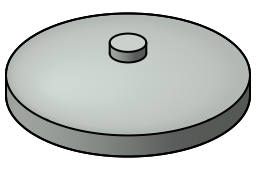</td>
    <td align="center">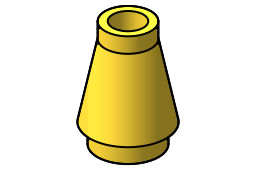</td>
  </tr>
  <tr>
    <td align="center">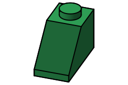</td>
    <td align="center">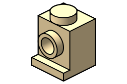</td>
    <td align="center">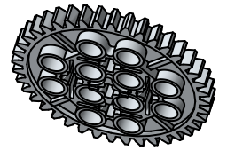</td>
    <td align="center">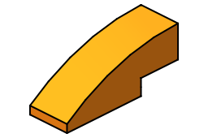</td>
  </tr>
  <tr>
    <td align="center">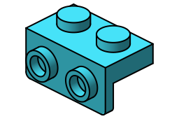</td>
    <td align="center">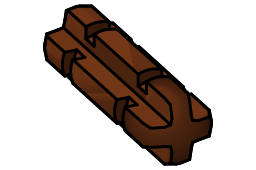</td>
    <td align="center">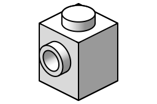</td>
    <td align="center">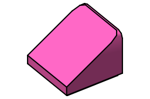</td>
  </tr>
</table>

*Twelve SVGs from `--shading outline` at assorted angles, colors, stroke
weights, and opacities — hover any icon for its exact command, or regenerate
them all with `scripts/render-gallery.sh`.*

## Setup (macOS)

    python3 -m venv .venv && .venv/bin/pip install -e .
    ./scripts/setup-ldview.sh        # vendor/LDView.app + vendor/ldraw + potrace

LDView is x86_64-only on macOS; it runs under Rosetta automatically.

### Porting to Linux/Windows

Only the LDView invocation is platform-specific. Install LDView + potrace via your
package manager, then in `labels.toml` set `ldview = "/path/to/ldview"` and
`ldview_launcher = []`. No code changes needed; `setup-ldview.sh` is macOS-only.

## Usage

    # both PNG outputs, normal shading
    .venv/bin/python -m brick_icons.cli 3001 --mode both --out out

    # cel-shaded, 1-bit Atkinson dither, batch from a list, 360 dpi
    .venv/bin/python -m brick_icons.cli --list bins.txt --shading cel \
        --mode mono --dither atkinson --dpi 360 --out out

    # vector outline SVG, top-down
    .venv/bin/python -m brick_icons.cli 3001 --format svg --shading outline \
        --angle top --out out

    # size by physical tape
    .venv/bin/python -m brick_icons.cli 3001 --label-mm 24 12 --mode mono

A curated starter parts list spanning bricks/plates/tiles/slopes/round/technic
ships as `parts.txt`:

    .venv/bin/python -m brick_icons.cli --list parts.txt --format both \
        --shading outline --mode both --out out

## CLI reference

Defaults shown come from `labels.toml` overriding the built-ins in
`brick_icons/config.py`; every flag can also be set as a key in the TOML
(dashes become underscores).

### Input & output

#### `parts` (positional)

LDraw part ids (`3001`) or paths to `.dat`/`.ldr`/`.mpd` files.

#### `--list FILE`

Read part ids from a file, one per line, instead of positionals. Whole-line
and inline `#` comments and blank lines are ignored.

#### `--out DIR`

Output directory (default `out`). Files are named `<part>.svg`,
`<part>.gray.png`, `<part>.mono.png`, `<part>.color.png`.

#### `--root DIR`

Project root used to resolve `labels.toml` and relative paths in it
(default `.`).

#### `--config FILE`

Explicit TOML config path (default `<root>/labels.toml`).

#### `--format png|svg|both`

Output format (default `png`). SVG requires `--shading outline` or `cel`.

#### `--mode gray|mono|color|both`

Which PNGs to emit (default `both` = gray + mono). `gray` is a full-resolution
grayscale master; `mono` is 1-bit, dithered, and fit to the label size;
`color` is a raw flattened color preview that ignores `--shading`.

### View

#### `--angle PRESET|LAT,LONG`

Camera angle: `iso` (default), `front`, `back`, `left`, `right`, `top`,
`bottom`, or explicit `LAT,LONG` in degrees (iso is `30,45`).

#### `--light LAT,LONG`

View-space light direction for `--shade-style`: elevation above the view
horizon, then azimuth around the view axis (`0,0` = frontal, positive azimuth
= from the viewer's left). Default is upper-left, roughly `37,39`.

### Shading & style

#### `--shading normal|cel|outline`

Rendering pipeline (default `normal`). `normal` and `cel` rasterize via
LDView; `outline` is the pure-Python vector hidden-line-removal renderer (no
LDView/Rosetta needed) — see Notes below.

#### `--cel-levels N`

Number of tonal bands for `cel` shading (default 4).

#### `--shade-style none|flat3`

Surface fills for `outline` SVGs (default `none` = line art only). `flat3`
paints each face: three stylized tones for flat faces by orientation, smooth
Lambert gradients for curved surfaces.

#### `--part-color 0xRRGGBB`

Part color (default a neutral gray). Tints LDView renders and drives the
`--shade-style` palette.

#### `--opacity 0-1`

Face-fill opacity for SVG output (default 1). Below 1, hidden-geometry
culling is disabled — every edge and face is drawn, painted far-to-near — so
interior structure shows through the translucent body (see the round brick in
the gallery).

#### `--svg-bg PAINT`

SVG background: a color (`white`, `#rrggbb`) or `none` for transparent
(the default).

### Outline strokes

#### `--line-width N`

Stroke width of interior edges in output pixels (default 2). Applies to the
outline mono PNG and, scaled, to the SVG.

#### `--silhouette-width N`

Stroke width of smooth-silhouette contours — cylinder limbs, folds — in
output pixels (default 2). Keep it equal to `--line-width` so limb lines
don't read heavier than the rim arcs and box edges they abut.

#### `--line-mm MM` / `--silhouette-mm MM`

Physical stroke widths (default 0.2 mm each), used instead of the pixel
widths when `--scale-mode physical`.

### Sizing

#### `--width PX` / `--height PX`

Label canvas in pixels (default 256 x 170). Ignored when `--label-mm` is
given.

#### `--label-mm W H`

Size the canvas from physical tape dimensions in mm; converted to pixels via
`--dpi`.

#### `--dpi N`

Printer resolution for the `--label-mm` conversion (default 180).

#### `--margin PX`

Blank border inside the canvas (default 6).

#### `--scale 0-1`

Part fill fraction of the canvas (default 1.0).

#### `--scale-mode fit|physical`

`fit` (default) scales the part to the canvas. `physical` sizes the SVG in
real mm so different parts print at true relative scale (see the example
above); strokes come from `--line-mm`/`--silhouette-mm`.

### Tone & dithering (PNG)

#### `--dither threshold|floyd|ordered|atkinson`

1-bit conversion for `mono` output (default `atkinson`).

#### `--threshold N`

Cutoff for `--dither threshold` (default 128).

#### `--gamma G`

Gamma applied to the grayscale tone curve (default 1.0).

#### `--levels BLACK WHITE`

Input levels remap: gray values at or below BLACK go to black, at or above
WHITE to white (like the Photoshop levels dialog).

### Quality & debugging

#### `--render-px N`

Supersample square for LDView renders, and the working resolution of the
outline renderer (default 2048).

#### `--curve-quality N`

LDView curve subdivision (default 12). The outline renderer's analytic curves
are exact and ignore this.

#### `--debug-dir DIR`

Save intermediate stages (`render/`, `tone/`, `mono/`) instead of deleting
them.

## Notes

- `gray` output is saved at full render resolution — a high-res master for the
  driver to scale and dither downstream. Only `mono` is fit to the label pixel
  size (`--width`/`--height` or `--label-mm`).
- `--mode color` emits the raw flattened color render and ignores `--shading`
  (color is a preview only; the printer is 1-bit).
- `--shading outline` runs a pure-Python hidden-line-removal renderer. Curved
  LDraw primitives (cylinders, discs, rings, circular edges) are substituted with
  their exact analytic shapes: their outlines are emitted as true elliptical arcs
  (clean, scalable SVG) and occluded against a continuous analytic depth field, so
  curves are smooth and resolution-independent. `--shade-style` fills get the
  same treatment: after the visible-fragment booleans, boundary runs that lie on
  a known projected circle are snapped back to true arcs (arc recovery), so
  curved fills scale exactly like the strokes. A final dedupe pass unions
  duplicate and overlapping stroke spans (LDraw subparts re-draw shared edges
  and rims many times) into one element each. Parts (or features) with no
  recognized curved primitive fall back to the faceted z-buffer pipeline (parse →
  project → z-buffer → visible edges + LDraw conditional-line silhouettes). It
  reads `vendor/ldraw/*.dat` directly and does **not** invoke LDView, so it is
  fast and deterministic. `cel`/`normal`/`color` still render via LDView. Stroke
  weight via `--line-width` / `--silhouette-width`.

See `docs/superpowers/specs/` for the design.
