# brick-icons

Render LEGO/LDraw parts as (optionally) lit and shaded SVG icons.

<table align="center">
  <tr>
    <td align="center">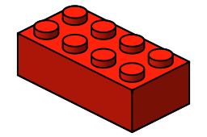</td>
    <td align="center">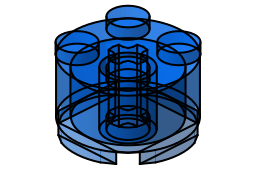</td>
    <td align="center">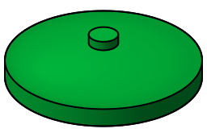</td>
    <td align="center">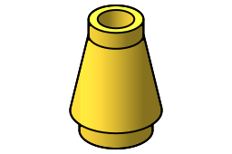</td>
  </tr>
  <tr>
    <td align="center">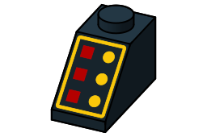</td>
    <td align="center">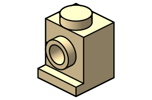</td>
    <td align="center">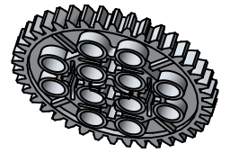</td>
    <td align="center">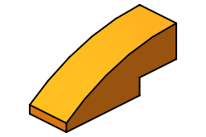</td>
  </tr>
  <tr>
    <td align="center">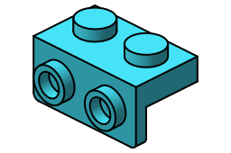</td>
    <td align="center">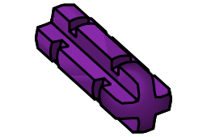</td>
    <td align="center">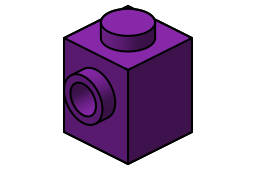</td>
    <td align="center">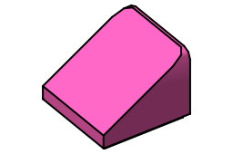</td>
  </tr>
  <tr>
    <td align="center">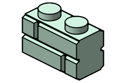</td>
    <td align="center">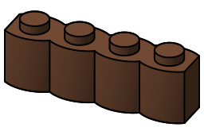</td>
    <td align="center">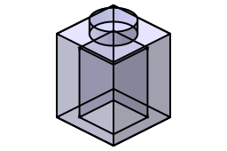</td>
    <td align="center">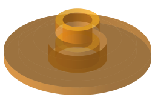</td>
  </tr>
</table>

*Sixteen SVGs from `--shading outline` at assorted angles, colors, stroke
weights, and opacities — including a printed part, whose decoration keeps its
own LDraw colors, and a strokeless fills-only render (zero stroke widths). Hover any icon for its exact command, or regenerate them
all with `scripts/render-gallery.sh`.*

## Setup (macOS)

    python3 -m venv .venv && .venv/bin/pip install -e .
    ./scripts/setup-ldview.sh        # vendor/LDView.app + vendor/ldraw + potrace

LDView 4.7 is a universal binary, so it runs native on both Apple Silicon and
Intel. The pinned dmg and its sha256 live in `scripts/external-deps.lock`.

### Porting to Linux/Windows

Only the LDView invocation is platform-specific. Install LDView + potrace via your
package manager, then in `labels.toml` set `ldview = "/path/to/ldview"`. No code
changes needed; `setup-ldview.sh` is macOS-only. `ldview_launcher` is an argv
prefix for LDView, empty by default — set it if your platform needs a wrapper.

## Usage

    # both PNG outputs, normal shading
    .venv/bin/python -m brick_icons.cli 3001 --mode both --out out

    # cel-shaded, 1-bit Atkinson dither, batch from a list, 360 dpi
    .venv/bin/python -m brick_icons.cli --list bins.txt --shading cel \
        --mode mono --dither atkinson --dpi 360 --out out

    # vector outline SVG, top-down
    .venv/bin/python -m brick_icons.cli 3001 --format svg --shading outline \
        --angle top --out out

    # size by physical tape
    .venv/bin/python -m brick_icons.cli 3001 --label-mm 24 12 --mode mono

A curated starter parts list spanning bricks/plates/tiles/slopes/round/technic
ships as `parts.txt`:

    .venv/bin/python -m brick_icons.cli --list parts.txt --format both \
        --shading outline --mode both --out out

Printed parts can also have their decoration lifted off as a flat texture:

    .venv/bin/python -m brick_icons.cli decal 3941p01 --out out

## Lab server

A local server for inspecting renders and filing defects:

```sh
pip install -e '.[lab]'
python -m brick_icons.lab       # http://127.0.0.1:8792
```

Its config schema is read off `cli.build_parser()`, and a render runs the argv
it was handed through the CLI's own parse-config-render path — so a flag the
CLI grows appears in the lab with no other change, and the two cannot disagree
about what a parameter does.

The frontend lives in `lab/`:

```sh
cd lab && npm install
npm run dev            # http://localhost:5178, proxying /api to the server
```

Type a part id in the title bar to open a trial. Its control panel is built
from `/api/schema` at boot, so it is the CLI's flag set; the command in the
status bar is the argv the server ran, and running it yourself gives the same
SVG the pane shows.

## Decal extraction

    brick-icons decal PARTS... [--out DIR] [--svg-bg PAINT] [--texture-px N]

`decal` writes a part's printed decoration as a standalone SVG, unwrapped off
the surface it is printed on and laid flat: `out/<part>.decal.svg`, or
`<part>.decal.0.svg`, `.1.svg` … for a part printed on more than one surface,
biggest print first. The numbering earns its keep on a high-poly part, where
the print scatters across dozens of small facet planes: a modern minifig torso
emits `.0` and `.1` as its front and back, then 56 slivers.
The texture is drawn on the outline of the face it came from — a road sign's
print on its octagon, a torso's on the torso's trapezoid — at one uniform
scale in LDU, so the print stays isometric with the part.

A decal has no viewpoint, so none of the view, sizing or stroke flags apply.

    # a batch, on a white ground so the SVGs can be eyeballed directly
    brick-icons decal --list printed.txt --out decals --svg-bg white

Parts carrying no bindable decoration are reported, and the run exits `1`:

    $ brick-icons decal 3941p01 3001
    [1/2] 3941p01 -> out/3941p01.decal.svg
    [2/2] 3001: no decal
    1/2 yielded no decal

#### `--texture-px N`

Longer edge of the texture canvas in px (default 900). The aspect comes from
the carrier, not from the decal's own bounds.

#### `--svg-bg PAINT`

`none` (default) for a transparent ground, or a color. Note that a white print
is invisible on the white one.

### The minifig neck mark

One thing is dropped deliberately. LDraw authors a minifig neck as a
270-degree body cylinder plus a 90-degree one in black — `973.dat` calls it the
"neck mark" — which an assembled minifig's head covers. It is authored exactly
as real print is, so it is caught by position and size together: a coloured
primitive standing proud of the part's body and covering no more than a
quarter of its surface's ring. Across all 11,220 printed parts that is 1,388
torso necks and nothing else; `scripts/sweep-marker-prims.py` re-derives it
against the vendored LDraw tree.

Renders are unaffected — the band is on the real part, so `--shading outline`
still draws it.

## CLI reference

Defaults shown come from `labels.toml` overriding the built-ins in
`brick_icons/config.py`; every flag can also be set as a key in the TOML
(dashes become underscores).

### Input & output

#### `parts` (positional)

LDraw part ids (`3001`) or paths to `.dat`/`.ldr`/`.mpd` files.

#### `--list FILE`

Read part ids from a file, one per line, instead of positionals. Whole-line
and inline `#` comments and blank lines are ignored.

#### `--out DIR`

Output directory (default `out`). Files are named `<part>.svg`,
`<part>.gray.png`, `<part>.mono.png`, `<part>.color.png`.

#### `--root DIR`

Project root used to resolve `labels.toml` and relative paths in it
(default `.`).

#### `--config FILE`

Explicit TOML config path (default `<root>/labels.toml`).

#### `--format png|svg|both`

Output format (default `png`). SVG requires `--shading outline` or `cel`.

#### `--mode gray|mono|color|both`

Which PNGs to emit (default `both` = gray + mono). `gray` is a full-resolution
grayscale master; `mono` is 1-bit, dithered, and fit to the label size;
`color` is a raw flattened color preview that ignores `--shading`.

### View

#### `--angle PRESET|LAT,LONG`

Camera angle: `iso` (default), `front`, `back`, `left`, `right`, `top`,
`bottom`, or explicit `LAT,LONG` in degrees (iso is `30,45`).

#### `--light LAT,LONG`

View-space light direction for `--shade-style`: elevation above the view
horizon, then azimuth around the view axis (`0,0` = frontal, positive azimuth
= from the viewer's left). Default is upper-left, roughly `37,39`.

### Shading & style

#### `--shading normal|cel|outline`

Rendering pipeline (default `normal`). `normal` and `cel` rasterize via
LDView; `outline` is the pure-Python vector hidden-line-removal renderer (no
LDView/Rosetta needed) — see Notes below.

#### `--cel-levels N`

Number of tonal bands for `cel` shading (default 4).

#### `--shade-style none|flat3`

Surface fills for `outline` SVGs (default `none` = line art only). `flat3`
paints each face: three stylized tones for flat faces by orientation, smooth
Lambert gradients for curved surfaces.

#### `--part-color SPEC`

Part color (default a neutral gray). Tints LDView renders and drives the
`--shade-style` palette. `SPEC` is any of:

| form | example | meaning |
|---|---|---|
| hex | `0xc91a09`, `#c91a09`, `c91a09` | a literal color |
| LDraw code | `4`, `71` | Red, Light Bluish Grey |
| color name | `red`, `light_bluish_grey`, `light bluish gray` | case, `_`/`-`/space and the gray/grey spelling all fold |

Six hex digits are read as hex, so `000016` is a color and `16` is LDraw code
16. `--list-colors` prints the whole palette.

A translucent color supplies `--opacity` from its LDConfig `ALPHA` unless you
pass `--opacity` yourself, so `--part-color trans_red` is a one-flag trans
brick.

Codes resolve against the vendored `vendor/ldraw/LDConfig.ldr`, whose values
track current LDraw and differ from the hexes in the gallery above — code `4`
is `#B40000`, not the `0xc91a09` used by the red brick.

#### `--list-colors`

Print every LDraw color as `code  name  hex` (plus `alpha NNN` for translucent
ones) and exit.

#### `--opacity 0-1`

Face-fill opacity for SVG output (default 1). Below 1, hidden-geometry
culling is disabled — every edge and face is drawn, painted far-to-near — so
interior structure shows through the translucent body (see the round brick in
the gallery).

#### `--svg-bg PAINT`

SVG background: a color (`white`, `#rrggbb`) or `none` for transparent
(the default).

### Outline strokes

#### `--line-width N`

Stroke width of interior edges in output pixels (default 2). Applies to the
outline mono PNG and, scaled, to the SVG.

#### `--silhouette-width N`

Stroke width of smooth-silhouette contours — cylinder limbs, folds — in
output pixels (default 2). Keep it equal to `--line-width` so limb lines
don't read heavier than the rim arcs and box edges they abut.

#### `--line-mm MM` / `--silhouette-mm MM`

Physical stroke widths (default 0.2 mm each), used instead of the pixel
widths when `--scale-mode physical`.

### Sizing

#### `--width PX` / `--height PX`

Label canvas in pixels (default 256 x 170). Ignored when `--label-mm` is
given.

#### `--label-mm W H`

Size the canvas from physical tape dimensions in mm; converted to pixels via
`--dpi`.

#### `--dpi N`

Printer resolution for the `--label-mm` conversion (default 180).

#### `--margin PX`

Blank border inside the canvas (default 6).

#### `--scale 0-1`

Part fill fraction of the canvas (default 1.0).

#### `--scale-mode fit|physical`

`fit` (default) scales the part to the canvas. `physical` sizes the SVG in
real mm so different parts print at true relative scale (see the example
above); strokes come from `--line-mm`/`--silhouette-mm`.

### Tone & dithering (PNG)

#### `--dither threshold|floyd|ordered|atkinson`

1-bit conversion for `mono` output (default `atkinson`).

#### `--threshold N`

Cutoff for `--dither threshold` (default 128).

#### `--gamma G`

Gamma applied to the grayscale tone curve (default 1.0).

#### `--levels BLACK WHITE`

Input levels remap: gray values at or below BLACK go to black, at or above
WHITE to white (like the Photoshop levels dialog).

### Quality & debugging

#### `--render-px N`

Supersample square for LDView renders, and the working resolution of the
outline renderer (default 2048).

#### `--curve-quality N`

LDView curve subdivision (default 12). The outline renderer's analytic curves
are exact and ignore this.

#### `--engine naive|occt`

Which geometry engine performs hidden-line removal (default `naive`). `occt`
runs OpenCASCADE's exact BRep kernel: recognized LDraw primitives become real
cylinders, cones and annular faces, occlusion is exact, and arcs are read off
the curve rather than refitted from a polyline. It needs the optional extra —
`pip install -e '.[occt]'`, which is ~935MB — and raises rather than silently
falling back to `naive`, so a part it cannot draw fails loudly.

It is not the default yet: a body no primitive matches still arrives as raw
triangles and loses the arcs `arcfit` recovers on the naive path (`32062`, all
19), and several parts carry known artifacts. `scripts/compare-engines.py`
re-derives the current per-part deltas across the `outline` corpus; the
`occt-port` branch's handoff lists what is still open.

#### `--debug-dir DIR`

Save intermediate stages (`render/`, `tone/`, `mono/`) instead of deleting
them. On the outline path it also writes `<part>.unwrap.svg` — the same
extraction [`decal`](#decal-extraction) performs, on a white ground, which is
the only way to check that decoration bound to the right carrier without
reading projected output.

## Golden conformance corpus

The baseline the engine swap is measured against, frozen from the current
renderer. Two seams are covered, because the CLI touches the engine at exactly
two points: `hlr.visible_segments` (the view path) and `hlr.part_geometry`
(decal extraction, no view).

```
python scripts/select-decal-corpus.py               # pick the extraction corpus
python scripts/freeze-goldens.py                    # render seam -> tests/goldens/
python scripts/freeze-goldens.py --seam extraction  # decal seam
python scripts/freeze-goldens.py --out /tmp/new     # a run to compare
python scripts/compare-goldens.py /tmp/new --out report.md
```

**The extraction corpus is filtered to parts that have a surface to print on.**
A decal binds to a *carrier* — a plane, cylinder, cone or disc it lies on. A
sculpted part has none: a Marge Simpson head is thousands of tiny triangles, so
every facet becomes its own carrier and the print shatters across 772 of them,
no one holding more than 3% of it. `select-decal-corpus.py` keeps a part only
if it has between 1 and 4 carriers at least as big as a 1x1 round tile's face
**and** yields something through `unwrap.significant_groups`, writing
`decal-corpus.txt` from `decal-candidates.txt`. Carrier size alone is a proxy
and passed 15 parts that still shattered into nothing usable; the second test
asks the question directly. 393 of 600 candidates survive, carrying 626 SVGs,
and every one of them extracts at least one decal. Repeated common shapes are
wanted — 41 of the rows are minifig torsos. Exceptions go in
`corpus-overrides.toml`, never in the generated file.

`decal-candidates.txt` is the pool it filters, written by
`select-decal-candidates.py`: 600 parts sampled every-Nth across all 11,220
printed parts, so the pool spans the id space. Taking a prefix instead — which
is what it used to be — stopped at `15525` and left the corpus with no classic
brick, plate or tile. Sampling keeps the library's proportions, so a shape
carrying many prints contributes many rows; that is coverage, not waste.

Cases live in `tests/goldens/manifest.toml` as data — a part list crossed with
a flag combo — so adding one is a row, not a code change. There is deliberately
no `cel` case: `--shading cel` is routed to `trace.cel_svg`, which posterizes
the LDView raster and traces the bands, so it never reaches the engine and
cannot gate a change to it. Each render case
freezes three artifacts:

| artifact | what it is for |
|---|---|
| a line in `hashes.txt` | exact drift lock on **this** engine |
| `render/<case>.json` | structural summary: path and command counts, fill palette, gradient stops, bbox |
| `render/<case>.png` | `resvg` raster at a fixed width |

**The hash is not a cross-engine check.** A BRep kernel reads a circle off the
edge where this renderer refits a polyline onto a guessed arc, so a correct new
engine misses every hash by construction. `compare-goldens.py` deliberately
ignores them and diffs the raster and the summary instead. Read the arc/line
split as intent: on round parts `A` rising while `L` falls is the swap working,
and a round part whose `A` count does not move is the suspicious one.

**Tolerances default to zero because the noise floor is zero.** Two
independent full freezes of the unchanged engine agree exactly — every hash
identical, raster RMSE 0.000, no summary field moved. So a nonzero difference
is signal, and `--rmse-tol` / `--bbox-tol` exist to absorb a *deliberate*
change, not measurement jitter.

`tests/test_goldens.py` holds the drift gate, skipped by default because it
needs LDView and minutes. `BRICK_GOLDENS=1` re-renders `3005` and nothing else,
so it passes green through a change to any other part; `=full` re-renders the
whole manifest (~27 min) and is the only run that verifies an engine change.

Rasters are calibrated against the pinned `resvg` in
[`scripts/external-deps.lock`](scripts/external-deps.lock); upgrading it moves
every golden with no engine change.

## Notes

- `gray` output is saved at full render resolution — a high-res master for the
  driver to scale and dither downstream. Only `mono` is fit to the label pixel
  size (`--width`/`--height` or `--label-mm`).
- `--mode color` emits the raw flattened color render and ignores `--shading`
  (color is a preview only; the printer is 1-bit).
- `--shading outline` runs a pure-Python hidden-line-removal renderer. Curved
  LDraw primitives (cylinders, discs, rings, circular edges) are substituted with
  their exact analytic shapes: their outlines are emitted as true elliptical arcs
  (clean, scalable SVG) and occluded against a continuous analytic depth field, so
  curves are smooth and resolution-independent. `--shade-style` fills get the
  same treatment: after the visible-fragment booleans, boundary runs that lie on
  a known projected circle are snapped back to true arcs (arc recovery), so
  curved fills scale exactly like the strokes. A final dedupe pass unions
  duplicate and overlapping stroke spans (LDraw subparts re-draw shared edges
  and rims many times) into one element each. Parts (or features) with no
  recognized curved primitive fall back to the faceted z-buffer pipeline (parse →
  project → z-buffer → visible edges + LDraw conditional-line silhouettes). It
  reads `vendor/ldraw/*.dat` directly and does **not** invoke LDView, so it is
  fast and deterministic. `cel`/`normal`/`color` still render via LDView. Stroke
  weight via `--line-width` / `--silhouette-width`.

See `docs/superpowers/specs/` for the design.
